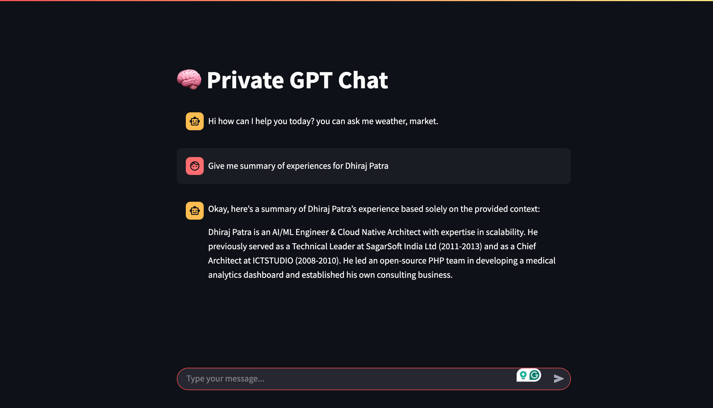
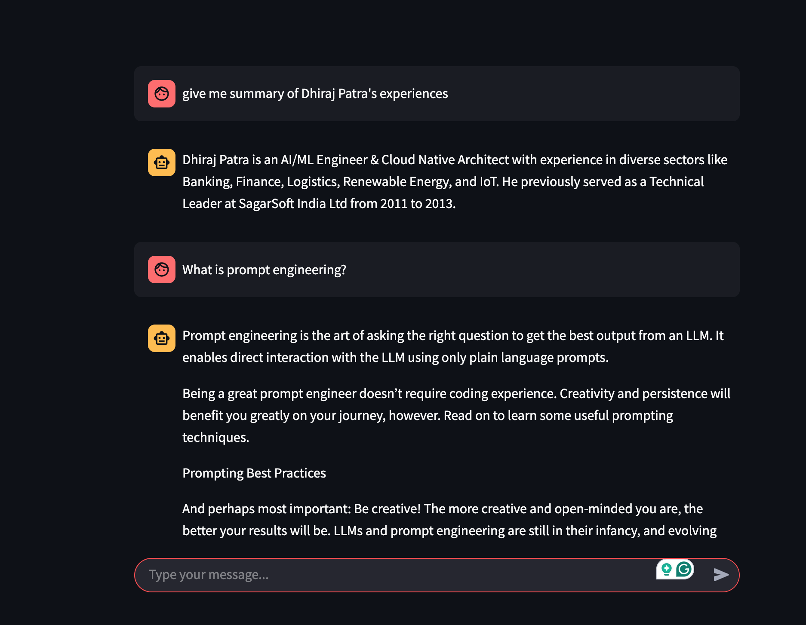
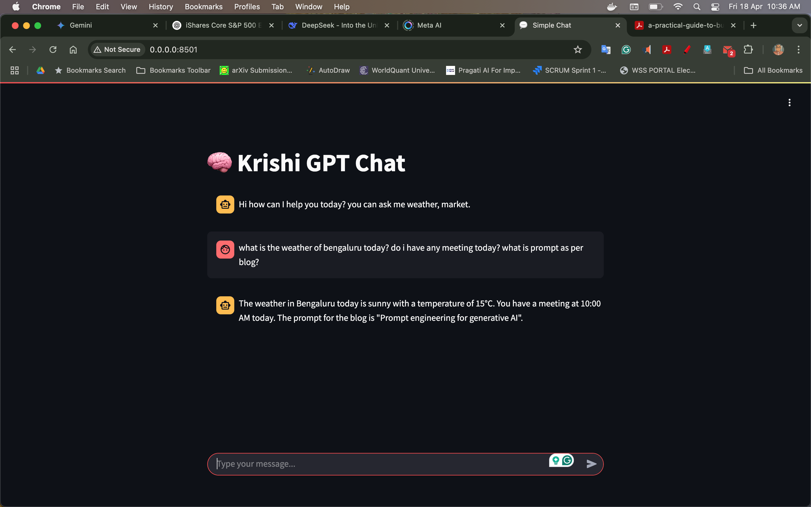
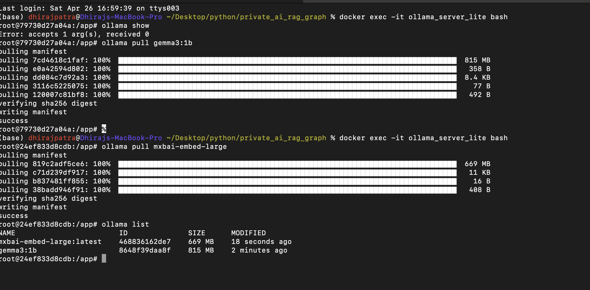
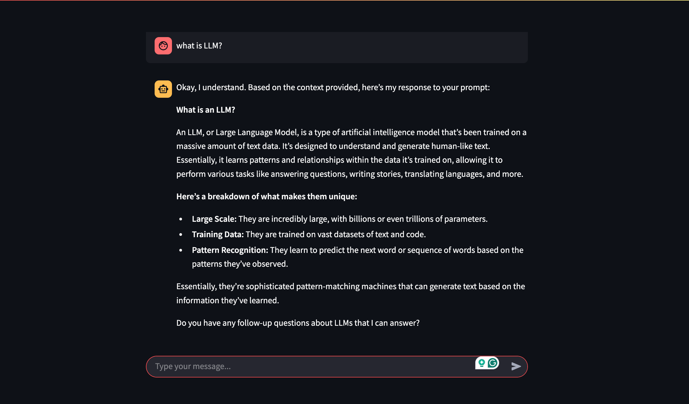
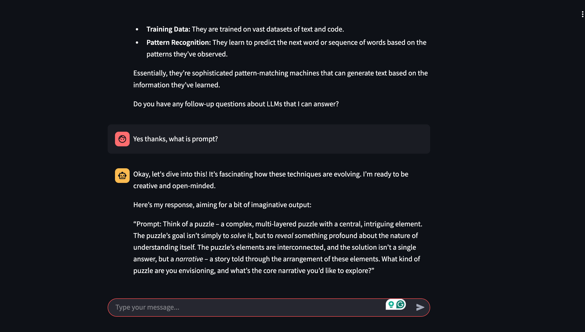

# Private AI RAG Graph with Gemma, Ollama and LangGraph

Developing a **Private AI** application running **offline** with **Gemma 1B** Edge AI model using **Ollama**, **LangGraph**, and **RAG**.

Summary of What We Are Doing in This Application:
Routing user questions intelligently between:

Vector Search (when similarity search is needed),

Graph Query (when structured query over knowledge graph is needed).

Decomposing questions into sub-queries for better graph + RAG usage.

Creating Cypher Queries dynamically:

Using context from RAG (retrieved docs),

Then forming Neo4j Cypher queries.

Using structured models (BaseModel) and structured output from LLMs for safe routing and Cypher generation.

End-to-end flow:
Route ➔ Decompose ➔ Retrieve ➔ Prompt ➔ Query Graph ➔ Answer

# 
# 
# 
# 
# 
# 

---

## **Prerequisites**

- Python 3.11 or higher
- pip (Python package installer)
- (Optional) Google Cloud Platform (GCP) account (for Gemini API access)
- (Optional) LangSmith account (for tracing and debugging)

---

## **Installation**

1. **Fork and Clone the Repository:**

    ```bash
    git clone <your_repository_url>
    cd <your_application_directory>
    ```

2. **Create `.env` File:**

    Copy `.env_copy` to `.env`:

    ```
    cp env_copy .env
    ```

    Fill `.env` file:

    ```
    MODEL=gemma:1b
    BASE_URL=http://ollama_server:11434
    LANGCHAIN_API_KEY=<your_langsmith_api_key>  # Optional for tracing
    LANGCHAIN_TRACING_V2="true"
    LANGCHAIN_PROJECT="Private_AI_Project"
    ```

---

## **Obtaining API Keys**

### 1. Google Gemini API Key (Optional)

- [Google AI Studio](https://makersuite.google.com/)
- [Google Cloud Console](https://cloud.google.com/)

> Enable Gemini API, create credentials, add to `.env` as `GOOGLE_API_KEY`.

### 2. LangSmith API Key (Optional)

- [LangSmith](https://smith.langchain.com/)

> Get API Key, add to `.env` as `LANGCHAIN_API_KEY`.

---

## **Running the Application**

1. **Using Docker Compose:**

    ```bash
    cd <your_application_directory>
    docker-compose up --build
    ```

2. **Using LangGraph CLI (Optional):**

    ```bash
    langgraph run --config langgraph.json
    # or
    langgraph dev
    ```

---

## **Development Notes**

- Enable LangSmith tracing by setting `LANGCHAIN_TRACING_V2="true"`.
- Check your runs visually in LangSmith UI.
- Add `.env` to your `.gitignore` to protect sensitive data.

> Helpful Links:
> - [LangGraph Documentation](https://python.langchain.com/docs/langgraph)
> - [LangChain Documentation](https://python.langchain.com/docs/get_started/introduction)
> - [LangSmith Documentation](https://docs.smith.langchain.com/)

---

## **Docker Compose Setup**

- **Run services**:

    ```bash
    docker-compose up --build
    ```

- **Stop services**:

    ```bash
    ctrl + c
    docker-compose down --remove-orphans
    ```

- **Services Launched**:
    - 🚀 `rag_service` on `http://localhost:5000`
    - 🧠 `ollama_server` on `http://localhost:11434`

- **System Requirements**:
    - Minimum 16GB RAM (32GB recommended)
    - i7 or similar CPU (GPU optional)
    - Disk space ~5GB for LLM model

> 🛑 Regularly clean Docker images/containers to avoid freezing issues!

## Ideation

In fact, **using Neo4j** to **store user query graphs** makes your application **future-proof, intelligent, and memory-augmented**.

---

### 🧠 Why Saving to Neo4j is Useful:

- **Memory**:  
  Save user's **interests**, **queries**, **entities** ➔ Build **user profiles** automatically over time.

- **Recommendation**:  
  Suggest **better pages, templates, flows** based on historical graph queries.

- **Personalization**:  
  Understand **user's past graphs** ➔ make new answers smarter.

- **Analytics**:  
  Analyze **what users are asking**, **trending nodes**, **common flows**.

- **Multi-hop Retrieval**:  
  If a user asks a vague or linked query, **traverse their past graphs** for better response.

- **Offline first**:  
  No cloud needed — **your app stays private** using Neo4j locally.

---

### 🛠️ How to Design It:

- **Each user query ➔ save as a small subgraph**:  
  - Nodes: Entities, Concepts, Keywords.
  - Edges: Actions, Relations.

- **Schema Example:**
  ```text
  (User)-[:ASKED]->(Query)-[:CONTAINS]->(Entity)
  (Entity1)-[:RELATED_TO]->(Entity2)
  (Query)-[:IN_CONTEXT_OF]->(Time/Season/Topic)
  ```

- **When responding later**:  
  - Fetch old graphs.
  - Merge graphs if needed.
  - Contextualize new answers.

---

### ⚡ Quick View:

| Action                         | Benefit                   |
|---------------------------------|----------------------------|
| Save user queries as graphs     | Build long-term memory     |
| Connect new queries to old ones | Better personalization     |
| Graph traversal for answers     | More accurate, multi-hop   |
| Local Neo4j usage               | Full privacy, offline mode |

---

### 🧩 Optional Design Tip:

You don't have to **save every query**.  
- Save only **important structured graphs** (based on filters like: if it involves selection, decision-making, etc.).
- Use **embedding + graph combo** if needed later for hybrid search.

---

✅ **Conclusion:**  
**Saving to Neo4j is highly recommended.**  
It will **unlock a second brain** for your Private AI system.

---

Would you also like me to show you **a simple flow**:  
_"User Query ➔ Create Graph ➔ Save into Neo4j ➔ Use later during RAG"_  
in a small neat diagram? 🎯  
(so you can directly plan architecture)

